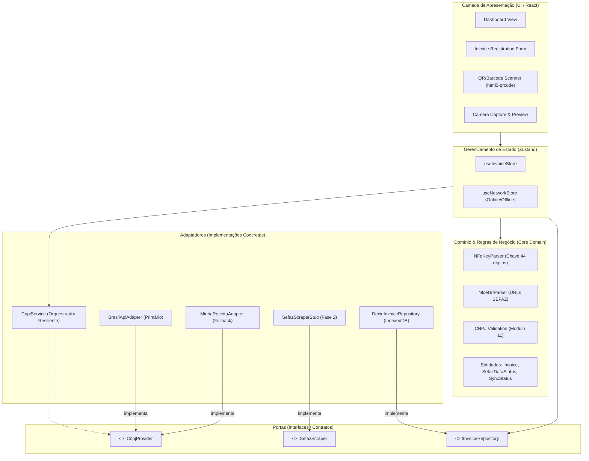

# 🏛️ Church Manager — Gestão de Notas & Cupons Fiscais

> **Módulo 1:** Aplicação PWA Single Page Application (SPA) **Offline-First** para captura, decodificação, enriquecimento cadastral e arquivamento de notas fiscais (**NF-e**, modelo 55) e cupons fiscais eletrônicos (**NFC-e**, modelo 65) para igrejas e congregações.

[](https://react.dev/)
[](https://www.typescriptlang.org/)
[](https://vite.dev/)
[](https://tailwindcss.com/)
[](https://web.dev/progressive-web-apps/)
[](https://dexie.org/)
[](LICENSE)

---

## 📋 Sumário
- [Visão Geral](#-visão-geral)
- [Principais Funcionalidades](#-principais-funcionalidades)
- [Arquitetura do Sistema (Ports & Adapters)](#-arquitetura-do-sistema-ports--adapters)
- [Stack Tecnológica & Decisões de Design](#-stack-tecnológica--decisões-de-design)
- [Estrutura do Projeto](#-estrutura-do-projeto)
- [Roteiro de Implementação em Etapas (Checkpoints)](#-roteiro-de-implementação-em-etapas-checkpoints)
- [Como Executar o Projeto](#-como-executar-o-projeto)
- [Documentação Técnica Detalhada](#-documentação-técnica-detalhada)

---

## 💡 Visão Geral

O **Church Manager** foi projetado para resolver o desafio diário de tesoureiros, voluntários e administradores de igrejas: coletar e prestar contas de comprovantes fiscais de compras físicas e despesas operacionais.

Muitas vezes, as compras ocorrem em locais com baixa conectividade à internet. Por isso, a aplicação opera sob a premissa **100% Offline-First**:
- Todos os registros, dados fiscais e fotos de comprovantes são persistidos imediatamente no banco de dados local do navegador (**IndexedDB** via **Dexie.js**).
- O usuário pode fotografar recibos físicos e escanear QR Codes mesmo sem conexão com a internet.
- Assim que o dispositivo recupera o acesso à rede, o enriquecimento de CNPJ é concluído e os dados ficam preparados para a sincronização remota.

---

## ✨ Principais Funcionalidades

1. 📷 **Scanner com Câmera em Tempo Real**:
   - Integração com `html5-qrcode` com suporte a câmera traseira (`environment`).
   - Leitura de **QR Codes de NFC-e** e códigos de barras de **NF-e (Code 128 / 44 dígitos)** com mira e animação de laser.
2. ⚡ **Parser Especializado de Chaves & URLs Fiscais**:
   - Decomposição da chave de 44 dígitos: UF de emissão, ano/mês, CNPJ do emitente, modelo (55 ou 65), série, número e validação matemática de dígito verificador via **Módulo 11**.
   - Extração da chave a partir de URLs de portais de SEFAZ estaduais (padrão nacional v2 `p=...|2|1|1|...`, `chNFe` e parâmetros de consulta), preservando a URL original para futuro web scraping.
3. 🔄 **Resiliência e Fallback de CNPJ (Ports & Adapters)**:
   - Consulta primária automática na **BrasilAPI** para obter a Razão Social da empresa emitente.
   - Fallback sequencial transparente para a **Minha Receita** caso o provedor primário falhe, oscile ou atinja timeout.
   - Cache em memória para evitar requisições repetidas.
   - **Edição Manual & Retry**: Em caso de falha de conexão ou CNPJ não encontrado, o usuário pode digitar a Razão Social livremente e re-tentar a qualquer momento.
4. 🖼️ **Captura & Compressão Otimizada de Comprovantes**:
   - Upload de foto do recibo usando `<input type="file" capture="environment" />`.
   - Compressão client-side em segundo plano via Web Worker com `browser-image-compression` para arquivos menores que 800 KB.
   - **Armazenamento Binário Nativo**: Persistência no IndexedDB em formato `Blob` (evitando o consumo excessivo de memória RAM e overhead de strings Base64).
5. 📊 **Dashboard & Gestão de Sincronização**:
   - Listagem ordenada das notas cadastradas com controle de status (`PENDING_SYNC` vs `SYNCED`).
   - Acompanhamento do status de enriquecimento da SEFAZ (`PENDING`, `SUCCESS`, `FAILED`, `MANUAL`).
   - Cards com indicadores financeiros totais (soma de valores e quantidade de notas).

---

## 🏗️ Arquitetura do Sistema (Ports & Adapters)

O projeto adota o padrão **Hexagonal (Ports and Adapters)** para isolar o núcleo da aplicação (domínio e regras de negócio) de serviços externos, dispositivos de hardware e APIs de terceiros:



---

## 🛠️ Stack Tecnológica & Decisões de Design

| Camada | Tecnologia | Justificativa |
| :--- | :--- | :--- |
| **Framework Base** | **React 19 + TypeScript + Vite 8** | Velocidade de carregamento instantânea, tipagem estrita de dados fiscais e HMR veloz. |
| **PWA & Offline** | **`vite-plugin-pwa` (Workbox)** | Instalação no celular (Android/iOS), Service Worker com pré-cache e estratégia `NetworkFirst` para APIs. |
| **Banco Local** | **Dexie.js (IndexedDB)** | Armazenamento no cliente com suporte nativo a `Blob` binário, consultas indexadas rápidas e reatividade. |
| **Estado Global** | **Zustand** | Store leve, sem boilerplate, com excelente desempenho para dados de scanner, formulário e rede. |
| **Leitura de Códigos**| **`html5-qrcode`** | Suporte direto a QR Code e Code 128 em navegadores móveis com gerenciamento estrito de ciclo de vida da câmera. |
| **Compressão** | **`browser-image-compression`** | Execução em Web Worker que comprime imagens de câmeras de celular (5MB–12MB) para < 800 KB sem travar a interface. |
| **Design System** | **Tailwind CSS + shadcn/ui primitives** | Tema escuro refinado (HSL), tipografia fluida, feedback visual de conectividade e animações de laser. |

---

## 📂 Estrutura do Projeto

```
church-manager/
├── plans/                              # 📚 Documentos de planejamento e arquitetura
│   ├── 00-overview-and-architecture.md
│   ├── 01-setup-and-tooling.md
│   ├── 02-database-and-storage.md
│   ├── 03-domain-parsers-and-validation.md
│   ├── 04-ports-and-adapters.md
│   ├── 05-state-and-ui-components.md
│   ├── 06-verification-and-testing-plan.md
│   └── 07-staged-implementation-roadmap.md
├── public/                             # Assets públicos e manifest PWA
├── src/
│   ├── adapters/                       # Implementações concretas de serviços externos
│   │   ├── cnpj/                       # BrasilApiAdapter, MinhaReceitaAdapter, CnpjService
│   │   ├── sefaz/                      # SefazScraperStub
│   │   └── storage/                    # Dexie ChurchManagerDB & DexieInvoiceRepository
│   ├── components/                     # Componentes React reutilizáveis
│   │   ├── layout/                     # Header (Online/Offline, badges)
│   │   ├── scanner/                    # Modal de scanner com câmera (html5-qrcode)
│   │   ├── photo/                      # Uploader de comprovante e compressão
│   │   └── invoices/                   # Formulário, cards e badges de status
│   ├── domain/                         # Regras de negócio puras (sem dependências de UI)
│   │   ├── entities/                   # Entidade Invoice, enums de status
│   │   ├── parsers/                    # Parser de chave de 44 dígitos e URLs de SEFAZ
│   │   └── validators/                 # Validador Módulo 11 da chave de acesso
│   ├── ports/                          # Interfaces e contratos arquiteturais
│   ├── services/                       # Utilitários (compressão de imagens)
│   ├── stores/                         # Stores globais do Zustand
│   ├── views/                          # Telas principais (Dashboard e Nova Nota)
│   ├── App.tsx                         # Componente raiz da aplicação
│   ├── index.css                       # Tokens de design e tema Tailwind
│   └── main.tsx                        # Ponto de entrada React
├── package.json
├── tailwind.config.js
├── tsconfig.json
└── vite.config.ts                      # Configuração Vite + PWA
```

---

## 🚦 Roteiro de Implementação em Etapas (Checkpoints)

O desenvolvimento está estruturado em 7 etapas incrementais. Cada etapa possui entregáveis autocontidos e critérios de parada seguros:

| Etapa | Foco Principal | Status | Entregável / Checkpoint |
| :---: | :--- | :---: | :--- |
| **1** | **Fundação do Projeto, PWA & Design System** | ✅ **Concluída** | Vite, Tailwind dark mode, Service Worker e Header com status de rede. |
| **2** | **Domínio Fiscal & Parsers (com Vitest)** | ✅ **Concluída** | Módulo 11, decomposição da chave de 44 dígitos, extração de URLs da SEFAZ e 13 testes unitários. |
| **3** | **IndexedDB (Dexie.js) & Fotos (Blob)** | ✅ **Concluída** | Banco `ChurchManagerDB`, repositório CRUD, compressão Web Worker e 7 testes com `fake-indexeddb`. |
| **4** | **Ports & Adapters (Resiliência de CNPJ)** | ✅ **Concluída** | BrasilAPI + Minha Receita com fallback automático, cache em memória e 8 testes unitários. |
| **5** | **Captura Física (Scanner & Câmera)** | ⏳ *Próxima* | Modal com `html5-qrcode`, ciclo de vida seguro e captura de fotos. |
| **6** | **Formulário de Registro Completo** | 📅 *Planejada* | Preenchimento automático, override manual e persistência no Dexie. |
| **7** | **Dashboard, Métricas & Auditoria PWA** | 📅 *Planejada* | Totalizadores em R$, busca em tempo real, visualizador de recibos e auditoria offline. |

---

## 🚀 Como Executar o Projeto

### Pré-requisitos
- **Node.js**: Versão 20.x ou 22.x (recomendada: `>= 20.18.0`)
- **NPM**: Versão 10.x ou 11.x

### Passo a Passo

1. **Clonar o Repositório**:
   ```bash
   git clone git@github.com:carloshatus/church-manager.git
   cd church-manager
   ```

2. **Instalar Dependências**:
   ```bash
   npm install
   ```

3. **Iniciar o Servidor de Desenvolvimento**:
   ```bash
   npm run dev
   ```
   Acesse a aplicação no navegador em: `http://localhost:5173/`

4. **Compilar para Produção (Build PWA)**:
   ```bash
   npm run build
   ```
   O bundle otimizado e os arquivos de Service Worker (`sw.js` e `workbox-*.js`) serão gerados na pasta `dist/`.

5. **Visualizar o Build de Produção Localmente**:
   ```bash
   npm run preview
   ```

---

## 📚 Documentação Técnica Detalhada

Para consultar as especificações completas de cada aspecto do projeto, acesse os arquivos no diretório [`plans/`](file:///home/carloshatus/Hatus/church-manager/plans/):

- [00 - Arquitetura Geral & Visão do Sistema](plans/00-overview-and-architecture.md)
- [01 - Setup Inicial & Ferramental (Tooling)](plans/01-setup-and-tooling.md)
- [02 - Camada de Dados & Armazenamento Local (Dexie.js & Blobs)](plans/02-database-and-storage.md)
- [03 - Parsers de Domínio & Regras Fiscais (Chave 44 Dígitos & URLs)](plans/03-domain-parsers-and-validation.md)
- [04 - Portas & Adaptadores (CNPJ Service, Fallback & Scraper)](plans/04-ports-and-adapters.md)
- [05 - Gerenciamento de Estado & Hierarquia de Componentes UI](plans/05-state-and-ui-components.md)
- [06 - Plano de Verificação, Testes & Garantia de Qualidade](plans/06-verification-and-testing-plan.md)
- [07 - Roteiro de Implementação em Etapas (Checkpoints)](plans/07-staged-implementation-roadmap.md)

---

## 📄 Licença
Distribuído sob a licença MIT. Consulte o arquivo `LICENSE` para obter mais informações.
