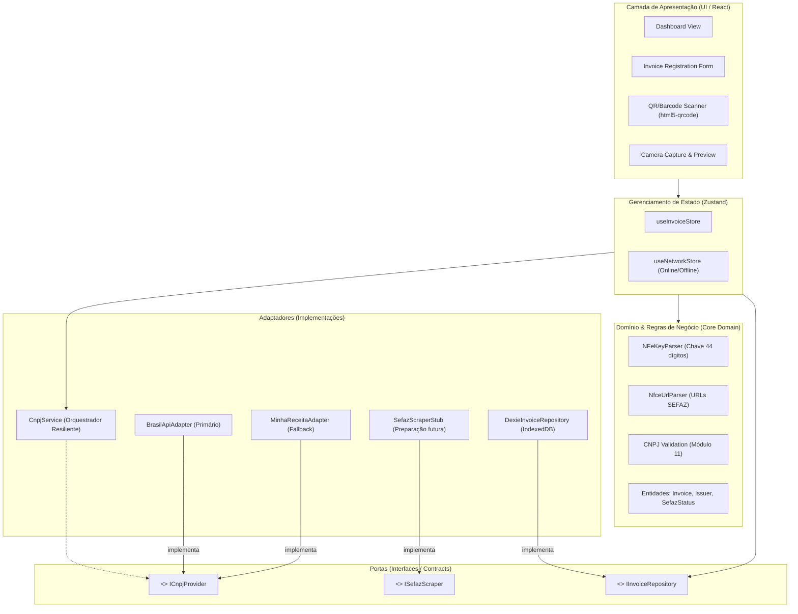
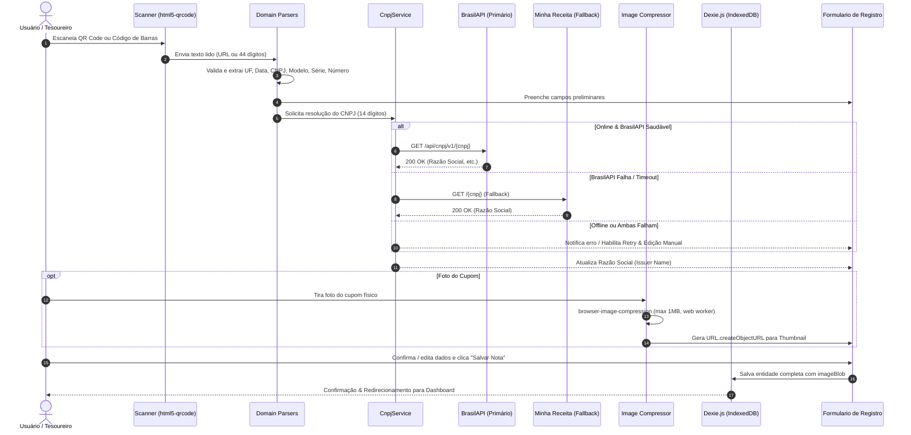

# 00 - Arquitetura Geral & Visão do Sistema

## 1. Visão Geral do Projeto
O **Church Manager (Módulo de Gestão de Notas & Cupons Fiscais)** é uma Single Page Application (SPA) Offline-First desenvolvida em React, TypeScript e Vite com suporte a PWA.

O objetivo deste primeiro módulo é permitir que tesoureiros, voluntários e administradores de igrejas e congregações registrem notas fiscais (NF-e, modelo 55) e cupons fiscais eletrônicos (NFC-e, modelo 65) diretamente do celular ou desktop, mesmo sem conexão ativa com a internet.

### Principais Capacidades:
1. **Captura via QR Code & Código de Barras**: Scanner em tempo real com câmera usando `html5-qrcode` para leitura do QR Code do cupom ou código de barras da NF-e.
2. **Parser Especializado de Chaves & URLs**: Decodificação da chave de 44 dígitos e extração de metadados fiscais (UF, AAMM de emissão, CNPJ emitente, Modelo, Série, Número, Código Numérico e Dígito Verificador). Identificação e extração da chave a partir de URLs de SEFAZ estaduais.
3. **Resiliência e Fallback de CNPJ (Ports & Adapters)**: Consulta automática de Razão Social via BrasilAPI com fallback transparente para Minha Receita.
4. **Captura e Otimização de Comprovantes**: Upload de fotos com compressão client-side (`browser-image-compression`) e armazenamento direto em formato binário (`Blob`) no IndexedDB (`Dexie.js`).
5. **Operação 100% Offline-First**: Registro local no IndexedDB com controle de sincronização (`syncStatus: PENDING_SYNC | SYNCED`) e status de enriquecimento da SEFAZ (`sefazDataStatus: PENDING | SUCCESS | FAILED | MANUAL`).
6. **Flexibilidade e Edição Manual**: Capacidade de sobrescrever qualquer campo extraído e botão de nova tentativa (*retry*) em caso de falha de conexão.

---

## 2. Diagrama de Arquitetura (Hexagonal / Ports & Adapters)

O sistema segue o padrão arquitetural **Hexagonal (Ports and Adapters)** para isolar o núcleo da aplicação (domínio e regras de negócio) de serviços externos que podem mudar ou falhar (APIs de CNPJ, scraping da SEFAZ, armazenamento local e hardware da câmera).



---

## 3. Fluxo de Execução de Ponta a Ponta



---

## 4. Estrutura de Diretórios Recomendada

```
church-manager/
├── public/
│   ├── favicon.ico
│   ├── pwa-192x192.png
│   ├── pwa-512x512.png
│   ├── apple-touch-icon.png
│   └── robots.txt
├── src/
│   ├── domain/                         # Entidades puras e regras de negócio
│   │   ├── entities/
│   │   │   └── invoice.ts              # Modelos de dados e tipos de status
│   │   ├── parsers/
│   │   │   ├── nfe-key-parser.ts       # Decomposição dos 44 dígitos
│   │   │   ├── nfce-url-parser.ts      # Extração de chaves em URLs da SEFAZ
│   │   │   └── ufs.ts                  # Tabela IBGE de estados
│   │   └── validators/
│   │       ├── cnpj-validator.ts       # Validador de DV de CNPJ
│   │       └── key-checksum.ts         # Validador módulo 11 da chave NF-e
│   ├── ports/                          # Contratos e Interfaces
│   │   ├── cnpj-provider.port.ts       # ICnpjProvider & CnpjDto
│   │   ├── sefaz-scraper.port.ts       # ISefazScraper contract
│   │   └── invoice-repository.port.ts  # IInvoiceRepository
│   ├── adapters/                       # Implementações concretas de serviços
│   │   ├── cnpj/
│   │   │   ├── brasil-api.adapter.ts
│   │   │   ├── minha-receita.adapter.ts
│   │   │   └── cnpj-service.ts         # Orquestrador com fallback
│   │   ├── sefaz/
│   │   │   └── sefaz-scraper.stub.ts   # Mock/Stub para fase 2
│   │   └── storage/
│   │       ├── db.ts                   # Dexie Database declaration
│   │       └── dexie-invoice.repository.ts
│   ├── services/                       # Serviços utilitários auxiliares
│   │   └── image-compression.service.ts
│   ├── stores/                         # Zustand Stores
│   │   ├── use-invoice-store.ts
│   │   └── use-network-store.ts
│   ├── components/                     # Componentes React
│   │   ├── ui/                         # shadcn/ui primitives (button, dialog, input, etc.)
│   │   ├── layout/
│   │   │   ├── header.tsx
│   │   │   └── nav-bar.tsx
│   │   ├── scanner/
│   │   │   ├── qr-scanner-modal.tsx    # html5-qrcode integration
│   │   │   └── barcode-manual-input.tsx
│   │   ├── photo/
│   │   │   ├── photo-uploader.tsx      # Camera input & compression
│   │   │   └── photo-preview-dialog.tsx
│   │   └── invoices/
│   │       ├── invoice-form.tsx        # Formulário com override manual & retry
│   │       ├── invoice-card.tsx
│   │       ├── invoice-list.tsx
│   │       └── status-badge.tsx
│   ├── views/                          # Telas principais
│   │   ├── dashboard-view.tsx
│   │   └── new-invoice-view.tsx
│   ├── hooks/                          # Hooks customizados React
│   │   ├── use-online-status.ts
│   │   └── use-scanner.ts
│   ├── App.tsx
│   ├── main.tsx
│   └── index.css
├── plans/                              # Documentos de Planejamento Técnico
├── vite.config.ts                      # Configuração Vite + PWA
├── tailwind.config.js                  # Tailwind design system
├── tsconfig.json
└── package.json
```

---

## 5. Matriz de Decisões Técnicas

| Requisito | Escolha Técnica | Motivo & Justificativa |
| :--- | :--- | :--- |
| **Armazenamento de Imagem** | `Blob` binário nativo no IndexedDB | Base64 consome ~33% mais memória RAM e armazenamento. IndexedDB suporta `Blob` de forma nativa e performática. |
| **Resiliência de CNPJ** | Padrão Adapter com Fallback sequencial | A BrasilAPI pode sofrer oscilações ou rate limit. O fallback para Minha Receita eleva a disponibilidade para >99%. |
| **Comunicação SEFAZ** | Interface `ISefazScraper` (Stub) | O scraping de portais estaduais exige estratégia própria de CORS/proxy. Deixar a porta isolada permite plugar o worker posteriormente sem alterar regras de negócio. |
| **Controle de Estado** | Zustand | Mais leve que Redux, menos boilerplate, excelente integração com Typescript e suporte nativo a persistência seletiva. |
| **PWA & Offline** | `vite-plugin-pwa` + `CacheFirst`/`NetworkFirst` | Registra service worker com pré-cache de assets da aplicação e fallback offline imediato. |
