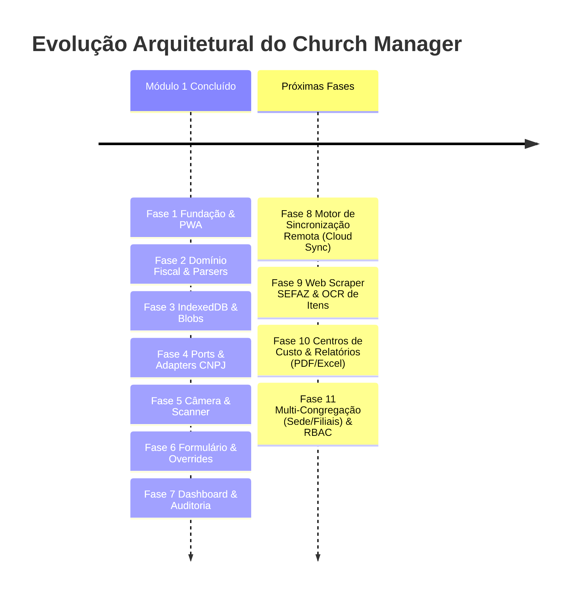

# 08 - Roteiro das Próximas Fases (Roadmap de Evolução)

Este documento estabelece o roadmap detalhado para a evolução do **Church Manager** após a conclusão do **Módulo 1 (Fases 1 a 7: Fundação, Parsers, Dexie.js, Resiliência CNPJ, Scanner, Formulário e Dashboard Offline-First)**.

O objetivo deste planejamento é orientar as próximas fases com a mesma disciplina arquitetural (Arquitetura Hexagonal, Ports & Adapters, Offline-First e tipagem estrita no TypeScript).

---

## 🗺️ Visão Geral do Roadmap



---

## 📋 Matriz Comparativa das Próximas Fases

| Fase | Título | Complexidade | Foco Principal | Entregável Chave |
| :---: | :--- | :---: | :--- | :--- |
| **8** | **Motor de Sincronização Remota (Cloud Sync Engine)** | Média-Alta | Fila de sincronização, envio em lote, upload de mídia e resolução de conflitos | `ISyncAdapter`, fila com retry exponencial, upload de fotos para bucket e sincronização bidirecional |
| **9** | **Web Scraping SEFAZ & OCR de Comprovantes** | Alta | Extração dos itens, quantidades, valores e tributos a partir de `qrCodeUrl` ou foto | Implementação do `ISefazScraper`, parser HTML de portais estaduais e fallback OCR |
| **10** | **Centros de Custo & Prestação de Contas (PDF/Excel)** | Média | Classificação por ministérios, teto orçamentário e exportação contábil | Relatórios formatados em PDF com fotos dos comprovantes e planilhas XLSX para auditoria |
| **11** | **Multi-Congregação & Controle de Acesso (RBAC)** | Alta | Suporte a filial/sede e níveis de permissão (Comprador, Líder, Tesoureiro) | Segregação de dados por congregação, autenticação segura e fluxo de aprovação de despesas |

---

## 🚀 Detalhamento das Próximas Fases

---

### 🌐 FASE 8: Motor de Sincronização Remota (Cloud Sync Engine)

#### Contexto & Objetivo
Atualmente, as notas são gravadas com `syncStatus = 'PENDING_SYNC'` no IndexedDB local. A Fase 8 implementa a ponte de comunicação entre o cliente offline e a nuvem (API REST, GraphQL ou Backend-as-a-Service como Supabase / Firebase / NestJS), permitindo a sincronização transparente e segura com tolerância a quedas de conexão.

#### Arquitetura & Portas
1. **Contrato de Sincronização (`ISyncAdapter`)**:
   ```typescript
   export interface SyncBatchResult {
     syncedIds: string[];
     failedIds: Array<{ id: string; error: string; retryable: boolean }>;
     serverTimestamp: string;
   }

   export interface ISyncAdapter {
     uploadReceiptPhoto(invoiceId: string, blob: Blob): Promise<{ photoUrl: string }>;
     pushInvoicesBatch(invoices: Invoice[]): Promise<SyncBatchResult>;
     pullUpdatedInvoices(sinceTimestamp: string): Promise<Invoice[]>;
   }
   ```
2. **Gerenciador de Fila Offline (Sync Queue Worker)**:
   - Fila FIFO no IndexedDB com registro de tentativas e timestamp do último erro.
   - Algoritmo de **Exponential Backoff com Jitter** (1s, 2s, 4s, 8s... até limite de 60s) para evitar sobrecarga no servidor.
   - Escuta ativa da `useNetworkStore`: ao retornar para o status `online`, dispara a fila automaticamente em segundo plano.
3. **Estratégia de Envio de Fotos**:
   - Envio em duas etapas:
     1. Upload do binário `imageBlob` para bucket de armazenamento (S3, Cloudflare R2 ou Supabase Storage), obtendo uma URL assinada ou pública.
     2. Envio do payload JSON da nota com a URL da foto vinculada.
   - Em caso de falha de upload da foto, a nota não perde a integridade e permanece em `PENDING_SYNC`.
4. **Resolução de Conflitos**:
   - Mecanismo baseado em `updatedAt`: estratégia *Last-Write-Wins* com log de auditoria no servidor para evitar sobrescrita de edições concorrentes de tesoureiros distintos.

#### Entregáveis da Fase 8:
- `src/ports/sync-provider.port.ts`
- `src/adapters/sync/rest-sync.adapter.ts` e `src/adapters/sync/supabase-sync.adapter.ts`
- `src/services/sync-queue.service.ts`
- Componente na UI: Barra de progresso de sincronização no Dashboard (`"Sincronizando 3 de 8 notas..."`), botão manual de `"Sincronizar Agora"` e modal com log de falhas com opção de retentativa individual.

---

### 🔍 FASE 9: Web Scraping SEFAZ & OCR de Comprovantes (Automação de Itens)

#### Contexto & Objetivo
No Módulo 1, preservamos a URL do QR Code (`qrCodeUrl`) e estabelecemos a porta arquitetural `ISefazScraper` (com o adaptador `SefazScraperStub`). A Fase 9 transforma essa preparação em realidade, permitindo que a aplicação consulte a SEFAZ estadual para baixar automaticamente todos os itens comprados (descrição do produto, quantidade, valor unitário, código NCM e tributos).

#### Desafios Técnicos & Soluções
1. **Restrições de CORS nos Portais SEFAZ**:
   - Portais da SEFAZ não possuem cabeçalhos `Access-Control-Allow-Origin: *`.
   - **Solução Arquitetural**: Criar um Cloudflare Worker / Serverless Proxy leve que recebe a `qrCodeUrl`, realiza o fetch com headers de navegador e retorna o HTML bruto ou JSON parseado para a aplicação.
2. **Diversidade de Portais Estaduais**:
   - Cada estado brasileiro (RS, SP, PR, MG, RJ, BA, etc.) possui um layout de portal NFC-e específico ou adota a SEFAZ Virtual Nacional.
   - Implementação de sub-parsers especializados:
     - `SefazParserRS`, `SefazParserSP`, `SefazParserNacionalV2`, etc.
3. **Fallback com OCR Client-Side (Tesseract.js / Cloud Vision)**:
   - Para recibos físicos sem QR Code legível ou notas emitidas em contingência manual, disponibilizar um analisador OCR opcional para ler o valor total e data a partir da foto capturada.

#### Estrutura de Dados dos Itens da Nota
```typescript
export interface InvoiceItem {
  id: string;
  itemNumber: number;
  description: string;
  quantity: number;
  unit: string; // UN, KG, CX, etc.
  unitPrice: number;
  totalPrice: number;
  ncm?: string;
}
```

#### Entregáveis da Fase 9:
- `src/domain/entities/invoice-item.ts`
- Implementações concretas de scrapers para as principais UFs no diretório `src/adapters/sefaz/parsers/`
- Tabela interativa de itens dentro do `InvoiceDetailsDialog`, permitindo visualização de cada item e conferência rápida com a foto do recibo.
- Atualização do status `sefazDataStatus` para `SUCCESS` ou `MANUAL` caso o usuário adicione itens manualmente.

---

### 📊 FASE 10: Centros de Custo, Orçamentos & Prestação de Contas (PDF/Excel)

#### Contexto & Objetivo
Uma igreja gerencia múltiplos ministérios e congregações (Ex.: Ministério Infantil, Louvor, Jovens, Missões, Patrimônio, Ação Social, Escola Bíblica). A tesouraria necessita classificar cada nota fiscal em seu respectivo Centro de Custo, acompanhar tetos orçamentários mensais e emitir balancetes de prestação de contas para aprovação pelo conselho fiscal.

#### Funcionalidades Chave
1. **Gestão de Centros de Custo & Ministérios**:
   - Cadastro local/remoto de centros de custo: `id`, `name`, `code`, `monthlyBudget`, `leaderName`.
   - Seleção do Centro de Custo no formulário de registro da nota fiscal.
2. **Controle de Teto Orçamentário**:
   - Barra de progresso visual de gastos do departamento no mês: `"Ministério Infantil: R$ 850,00 gastos de R$ 1.000,00 orçados (85%)"`.
   - Alerta visual quando uma nova nota exceder o orçamento previsto para o período.
3. **Exportação de Prestação de Contas em PDF**:
   - Geração client-side de relatório em PDF de alta resolução (usando `jspdf` e `jspdf-autotable` ou `@react-pdf/renderer`):
     - Cabeçalho oficial com dados da Igreja e congregação.
     - Período de apuração e departamento selecionado.
     - Tabela detalhada de despesas (data, fornecedor, CNPJ, número da nota, valor).
     - **Anexo visual de comprovantes**: miniaturas organizadas das fotos de cada recibo para conferência fiscal e assinatura dos auditores.
4. **Exportação para Planilhas (XLSX / CSV)**:
   - Exportação estruturada para Excel compatível com softwares contábeis convencionais.

#### Entregáveis da Fase 10:
- `src/domain/entities/cost-center.ts`
- `src/services/export/pdf-report-generator.ts`
- `src/services/export/excel-export.service.ts`
- Visualizador e seletor de Centros de Custo na tela de Nova Nota e filtros no Dashboard.

---

### 👥 FASE 11: Multi-Congregação & Controle de Acesso (RBAC)

#### Contexto & Objetivo
Igrejas com sede e congregações filiais necessitam de governança e segregação de informações. A Fase 11 adiciona autenticação de usuários, suporte a filiais e papéis de acesso:

#### Níveis de Acesso (RBAC)
- 🛒 **Comprador / Voluntário**: Pode apenas abrir o scanner, bater a foto do comprovante e registrar notas vinculadas ao seu ministério.
- 👔 **Líder de Departamento**: Visualiza as notas do seu departamento, aprova ou contesta registros de voluntários.
- 💼 **Tesoureiro Geral**: Visualiza todas as congregações, audita valores, edita registros e executa sincronizações fiscais.
- 📜 **Conselho Fiscal / Auditor**: Acesso exclusivo de leitura para gerar relatórios, baixar comprovantes e assinar digitalmente as prestações de contas.

#### Entregáveis da Fase 11:
- `src/domain/entities/user.ts` e `src/domain/entities/congregation.ts`
- Fluxo de login e gerenciamento de token JWT com renovação offline
- Filtro global de congregação no Header da aplicação para usuários com privilégios de sede.

---

## 📅 Ordem de Execução Recomendada

Para manter a consistência e o valor entregue aos usuários, recomenda-se a seguinte ordem de ataque:

1. **Passo 1 (Imediato)**: **Fase 8 (Motor de Sincronização Remota)** — Transforma o app em uma solução colaborativa conectada a uma nuvem central.
2. **Passo 2**: **Fase 10 (Centros de Custo & Relatórios PDF/Excel)** — Entrega alto valor gerencial imediato para a liderança da igreja mesmo antes de integrações avançadas de SEFAZ.
3. **Passo 3**: **Fase 9 (Web Scraping SEFAZ)** — Automatiza o detalhamento dos itens e NCM conforme as necessidades tributárias da igreja.
4. **Passo 4**: **Fase 11 (Multi-Congregação & RBAC)** — Escala a solução para redes de igrejas com dezenas de filiais.
